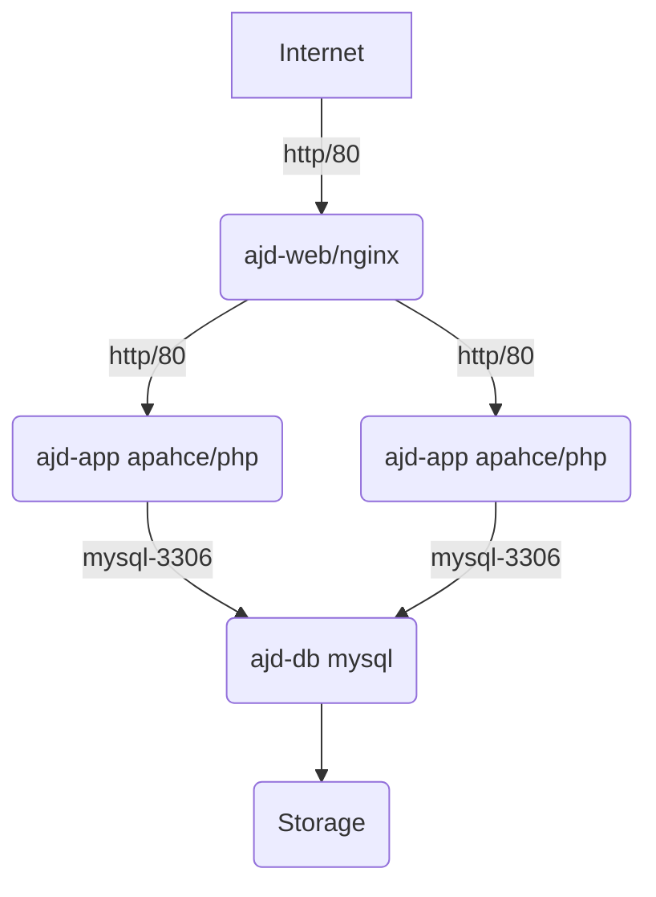

# GPC K8S

This is a POC Kubernetes deployment for DSR. To test it we'll have 3 services, a web frontend (nginx) which will proxy connection to an app server (apache/PHP) which will read data from a MySQL database. The data will persist between provisions.

The network looks similar like this:



From a kubernetes point of view, each box represents a Pod, a pod is a set of replicas. Each pod will have a service exposed to rest of the network. e.g. the app service expose port 80, the db layer will expose tcp/3306

## Install Notes

## Creating the service account

The first step is to create a service account. The service account will need the following permissions

* Cloud Build Service Account
* Kubernetes Engine Developer

I called mine gke-deployment, but you can call your Susan.

Make sure you download the key as a JSON file. You'll need this later

### Configuring the Git Repo

In Settings -> CI/CD, configure the following environment variables:

K8S_SECRET_SERVICE_ACCOUNT: Copy and paste the contents of your JSON file from the step above.
PROJECT_ID: The GCP Project ID

## Building the initial cluster

You should first create a cluster. A cluster is made up of a number of instances, running container optimised OS. These will run the actual docker instances.

```bash
# Create me a 2 node cluster with cluster name in London
gcloud container clusters create [clustername] --zone=europe-west2-b --num-nodes=2
```

Check the progress with `gcloud compute instances list`

## Building the docker images

Next will need to build and deploy the docker images. These can be deployed to the Container Repository on GCP. You can deploy these with the following commands:

```bash
docker build -t gcr.io/${PROJECT_ID}/${APPNAME}:v${VERSION} .
docker push gcr.io/${PROJECT_ID}/${APPNAME}:v${VERSION}
```

## App server

### Creating the Container
Starting at the app server level, create a YAML file similar to this:

```yaml
apiVersion: apps/v1
kind: Deployment
metadata:
  name: ajd-app
spec:
  selector:
    matchLabels:
      app: ajd-app
      tier: backend
      track: stable
  replicas: 2
  template:
    metadata:
      labels:
        app: ajd-app
        tier: backend
        track: stable
    spec:
      containers:
        - name: ajd-app
          image: "gcr.io/data-science-radar/ajd-app:v8"
          ports:
            - name: http
              containerPort: 80
          env:
           - name: MY_NODE_NAME
             valueFrom:
               fieldRef:
                   fieldPath: metadata.name
```

This file creates a Deployment (docker instance) with lables of backend and stable.

It will have two replicas and use the image `gcr.io/data-science-radar/ajd-app:v8`. Port 80 will be exposed to the cluster and the environment variable of `MY_NODE_NAME` will be exported to the operating system.

This will create _random-ish_ host names which can be viewed with `kubectl get pods -o wide`

```bash
[adeacon@centos7-ajd packages]$ kubectl get pods -o wide
NAME                       READY     STATUS    RESTARTS   AGE       IP          NODE                                          NOMINATED NODE
ajd-app-7fd55854f8-bkzpp   1/1       Running   0          20h       10.4.1.51   gke-dsr-ajd-test-default-pool-39bf1ea4-cm47   <none>
ajd-app-7fd55854f8-tcptf   1/1       Running   0          20h       10.4.1.48   gke-dsr-ajd-test-default-pool-39bf1ea4-cm47   <none>
ajd-db-774449b8d5-m6hnw    1/1       Running   0          19h       10.4.0.21   gke-dsr-ajd-test-default-pool-39bf1ea4-h5rl   <none>
ajd-web-5474b4f4b8-5m2x5   1/1       Running   0          22h       10.4.0.15   gke-dsr-ajd-test-default-pool-39bf1ea4-h5rl   <none>
```

### Creating the service
In order to use the container (or cluster of container) you need to create a service. A service definition looks like this:

```YAML
kind: Service
apiVersion: v1
metadata:
  name: ajd-app
spec:
  selector:
    app: ajd-app
    tier: backend
  ports:
  - protocol: TCP
    port: 80
    targetPort: http
```

After this has been created you can now refer to `ajd-app` as a hostname within you network.

## Applying the configuration

To make the configuration live, use the command:

`kubectl apply -f app.yaml,app-servce.yaml`

This will either create new objects or update them if they already exist.

### Worked Example

Let's say you want to upgrade from v8 to v9 of ajd-app. Here are the manual steps you'd take:

1. V8 output would look something like this:
```
[adeacon@centos7-ajd app]$ curl -s http://35.246.18.219/
hello, world, I'm ajd-app-7fd55854f8-bkzpp
The time is: Thursday 25th of April 2019 07:56:53 AM
ID: 1 - Name: Adam
ID: 2 - Name: Rob
ID: 3 - Name: Andrew
ID: 4 - Name: Alice
ID: 5 - Name: Bob
ID: 6 - Name: Charles
[adeacon@centos7-ajd app]$
```
2. Update your code. We'll be adding in a extra message to the first list
3. Create the new docker image:
```bash
[adeacon@centos7-ajd app]$ docker build -t gcr.io/data-science-radar/ajd-app:v9 .
Sending build context to Docker daemon  4.096kB
Step 1/3 : FROM php:apache
 ---> 1dffbbe4a5d3
Step 2/3 : RUN docker-php-ext-install mysqli && docker-php-ext-enable mysqli
 ---> Using cache
 ---> 645e83893d9d
Step 3/3 : COPY src/ /var/www/html
 ---> 8f5961fdec8e
Successfully built 8f5961fdec8e
Successfully tagged gcr.io/data-science-radar/ajd-app:v9
```
4. Push the image to Google Container Registry
```bash
[adeacon@centos7-ajd app]$ docker push gcr.io/data-science-radar/ajd-app:v9
The push refers to repository [gcr.io/data-science-radar/ajd-app]
be77f857e70b: Pushed
df1133fac9f2: Layer already exists
126b2d6f89b9: Layer already exists
100bb32a4989: Layer already exists
adcd464abf91: Layer already exists
bc0ba3b730b8: Layer already exists
7397c59ed3cc: Layer already exists
b73d403f1989: Layer already exists
dee68f37eb76: Layer already exists
3dc2dffa7ba8: Layer already exists
d1e78ca3aee3: Layer already exists
fd40ac5106c0: Layer already exists
819c60c22f5f: Layer already exists
5dd24cee12f7: Layer already exists
5dacd731af1b: Layer already exists
v9: digest: sha256:4a7ebf476f158a616e46897926edac99edcdb7ae69a266f0a30b97d3deb6e08a size: 3451
```
5. Update the app.yaml, cahnge the line:
`image: "gcr.io/data-science-radar/ajd-app:v8"`
to
`image: "gcr.io/data-science-radar/ajd-app:v9"`
6. Apply the change
```bash
[adeacon@centos7-ajd yaml]$ kubectl apply -f app.yaml
deployment.apps/ajd-app configured
```
7. Check the app has been deployed (Note the new "Nice to meet you" message in the first line)
```bash
[adeacon@centos7-ajd yaml]$ curl -s http://35.246.18.219/
hello, world, I'm ajd-app-5f99d464c7-dm2bf. Nice to meet you
The time is: Thursday 25th of April 2019 08:08:36 AM
ID: 1 - Name: Adam
ID: 2 - Name: Rob
ID: 3 - Name: Andrew
ID: 4 - Name: Alice
ID: 5 - Name: Bob
ID: 6 - Name: Charles
```

# :warning: IMPORTANT!!!!! :warning:
If you run `clusters create` you will automatically be given permission to that cluster. If you running it from a different laptop (for example, a CI job), you will need to run the command `gcloud container clusters get-credentials $CLUSTER --zone=$ZONE`

# TODO
- [ ] Update the .gitlab-ci.yaml to use the 'new' `kubectl apply -f [file]` method.
- [ ] Find a magical way on dynamically generating YAML files to update the image version.
- [ ] Split DSR microservices in to separate docker images.
- [ ] Decide if there are shared services or if every service is customer specific.
